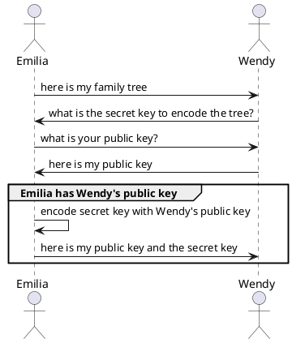

# Architectural Decision Records (ADR)

## ADR 1. How to send secret key to other user

### Context
To import and decode family tree user need to know secret key. 

### Decision
Secret key will be send along with public key of the user.
- pros
	+ encyption logic is hidden fro user
	+ simple menu
- cons
	- operation may be not intuitive enough

### Alternatives
1. sending secret key along with family tree, but encoded by public key of the recipient
	- pros
		+ encryption logic is hidden from user
		+ simple menu
	- cons
		- not safe to send data alogn with secret even if secret is encoded with different key
1. sending secret key as own operation
	- pros
		+ simple to implement
	- cons
		- user need to have technical understanding how encryption works
		- one more option in the menu

## TEMPLATE

## ADR ID. TITLE

### Context
Description of the situation. Describe facts.

### Decision
Decision and rationales.
- pros
	+ positive aspect
- cons
	- negative aspect

### Alternatives
1. description of the alternative
	- pros
		+ positive aspect
	- cons
		- negative aspect

### Links
Additional information.

